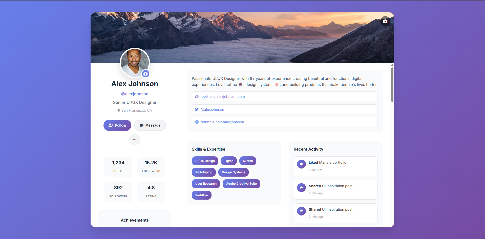

# Daily UI

## #00t: User Profile

Design a user profile and be mindful of the most important data, names, imagery, placement, etc. Is it for a serious profile? A social profile? (It's up to you!)

---
## 📸 Screenshot



## Project Structure and File Descriptions

```
index.html
README.md
images/
scripts/
    scripts.js
styles/
    styles.css
```

- **index.html**: The main HTML file containing the credit card payment form and layout.
- **styles/styles.css**: Contains all styles and layout rules for the project.
- **scripts/scripts.js**: Handles input formatting and validation for the form fields (card number, expiry date, CVV).
- **images/**: Folder containing images used in the form.
- **README.md**: Project description and documentation.

## Features


## Technologies Used

- HTML5
- CSS3 (with modern features like nested selectors)
- Vanilla JavaScript
- Form validation and input formatting